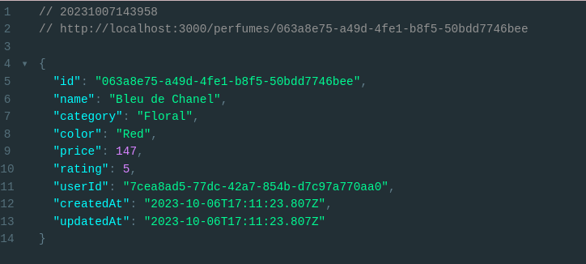

# Odour Perfumes Backend

Developed by <a href="https://github.com/sean-code" target="_blank">Sean Nganga</a> courtesy of Uptick NGR, in 10/2023

## Technologies used

- Prisma (ORM)
-  MYSQL (Database)
- Node JS (Backend Framework)
- JavaScript (Language)
- TypeScript (*)
- PlanetScale (Database Provider)


## Description

- <a href="https://www.postman.com/vlapp-emmerce/workspace/odour-perfumes/collection/26841432-2a54e5f4-4a02-4f5d-a3c8-15945bf80a14?action=share&creator=26841432" target="_blank">POSTMAN Workspace</a>

This project is a Node.js application that utilizes the Prisma ORM to interact with a MySQL database. It serves as a foundation for managing and retrieving data related to users and perfumes. The project includes a script for seeding the database with sample user and perfume data, providing a starting point for development.

Key Features:

Database Seeding: The included database seeding script populates the MySQL database with sample user and perfume data, enabling you to quickly get started with your project.

User Management: The application includes routes for finding all users and individual users by their UUID IDs.

Perfume Management: It offers various routes for managing and retrieving perfume data, including CRUD actions (Create, Read, Update, Delete) and filtering perfumes by category, color, price range, and rating.

Express.js Web Server: The application is built using Express.js, providing a web server for handling API requests.

Prisma ORM: Prisma is used as the ORM to interact with the MySQL database, making it easy to work with your data models.

This project provides a solid foundation for building a web application that manages user and perfume data. You can easily extend and customize it to suit your specific requirements.


## Setup Requirements
 Make sure these are installed in your system

- Git
- Web-browser of your choice
- Github
- MYSQL
- Prisma
- Node 16^
- JS

## Setup Installation

- Copy the github repository url
- Clone to your computer
- Open terminal and navigate to the directory of the project you just cloned to your computer
- Run the following command to start the server using virtual environment

```
$ git clone https://github.com/sean-code/perfumes-NGR.git 
```

- navigate to the project directory

```
$ cd perfumes-NGR
```
- Install project
```
$ npm install
```
- Database Configuration
```
Update your database configuration in your Prisma schema (usually found in schema.prisma). Make sure your database connection URL is set correctly in the .env
```
- Seeding Database
```
$ node seed.js
```

- Generate  Prisma Client

```
$ npx prisma generate
```

- Migrate DB Schema and Push changes

```
$ npx prisma migrate 
$ npx prisma db push

```

- Run server.js and/or prisma studio
```
$ prisma studio
```
```
$ node server.js
```


- open the browser on port 5555(prisma studio) / port 3000(json view)...


- interact with CRUD actions on this <a href="https://www.postman.com/vlapp-emmerce/workspace/odour-perfumes/collection/26841432-2a54e5f4-4a02-4f5d-a3c8-15945bf80a14?action=share&creator=26841432" target="_blank">POSTMAN workspace</a>


## Setup/Installation Requirements


## Some Screenshots

- MYSQL DB Tables
    <br>
  


- All Perfumes
  <br>
  


- By ID
    <br>
  

- By Category
    <br>
  


- By Color
    <br>
  

- PRISMA STUDIO VIEW -perfumes
    <br>
  


## Known Bugs

So far so good there are no bugs related to this project 😎

## Support and contact details 🙂

To make a contribution to the code used or any suggestions you can click on the contact link and message me your suggestions.

- Telegram: https://t.me/sean_code

## MIT License

Copyright (c) 2023 Sean

Permission is hereby granted, free of charge, to any person obtaining a copy
of this software and associated documentation files , to deal
in the Software without restriction, including without limitation the rights
to use, copy, modify, merge, publish, distribute, sublicense, and/or sell
copies of the Software, and to permit persons to whom the Software is
furnished to do so, subject to the following conditions:

The above copyright notice and this permission notice shall be included in all
copies or substantial portions of the Software.

THE SOFTWARE IS PROVIDED "AS IS", WITHOUT WARRANTY OF ANY KIND, EXPRESS OR
IMPLIED, INCLUDING BUT NOT LIMITED TO THE WARRANTIES OF MERCHANTABILITY,
FITNESS FOR A PARTICULAR PURPOSE AND NONINFRINGEMENT. IN NO EVENT SHALL THE
AUTHORS OR COPYRIGHT HOLDERS BE LIABLE FOR ANY CLAIM, DAMAGES OR OTHER
LIABILITY, WHETHER IN AN ACTION OF CONTRACT, TORT OR OTHERWISE, ARISING FROM,
OUT OF OR IN CONNECTION WITH THE SOFTWARE OR THE USE OR OTHER DEALINGS IN THE
SOFTWARE.


